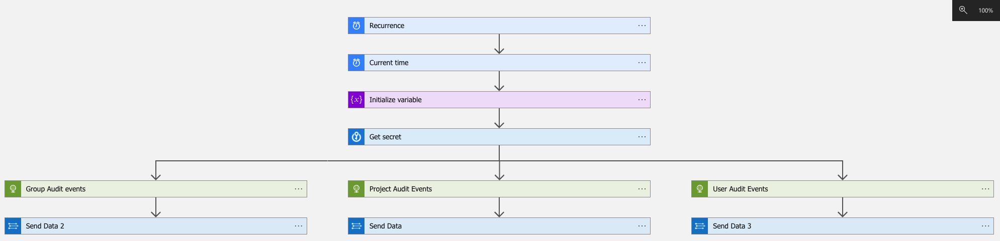
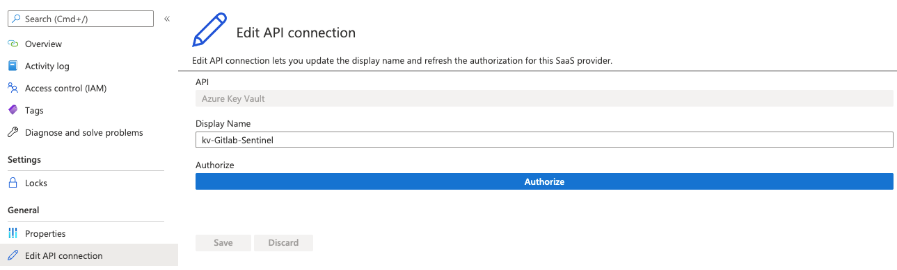

# Description

This log source uses logic app workflow with log analytics send data plugin. This Gitlab connector uses 3 types of audit logs (Project Audit, Group Audit and user events). For additional audit logs, you can modify the workflow with additional apis. For more information on Gitlab audit events, refer to https://docs.gitlab.com/ee/api/audit_events.html

## Prerequisites

1. Gitlab personal access token with read permissions for groups and projects.
2. Gitlab Group IDs and Project IDs required for audit log ingestion.
3. Log analytics workspace ID and shared Key

## Logic APP Design

 

## Deploy the Logic App template

[

Add projectIds and GroupIDs separated by comma in the ARM Template.

## Authorize API Connection

After deployment, go to `API Connections` to authorize for:

1. Azure Keyvault by clicking on `Authorize button`.
    
